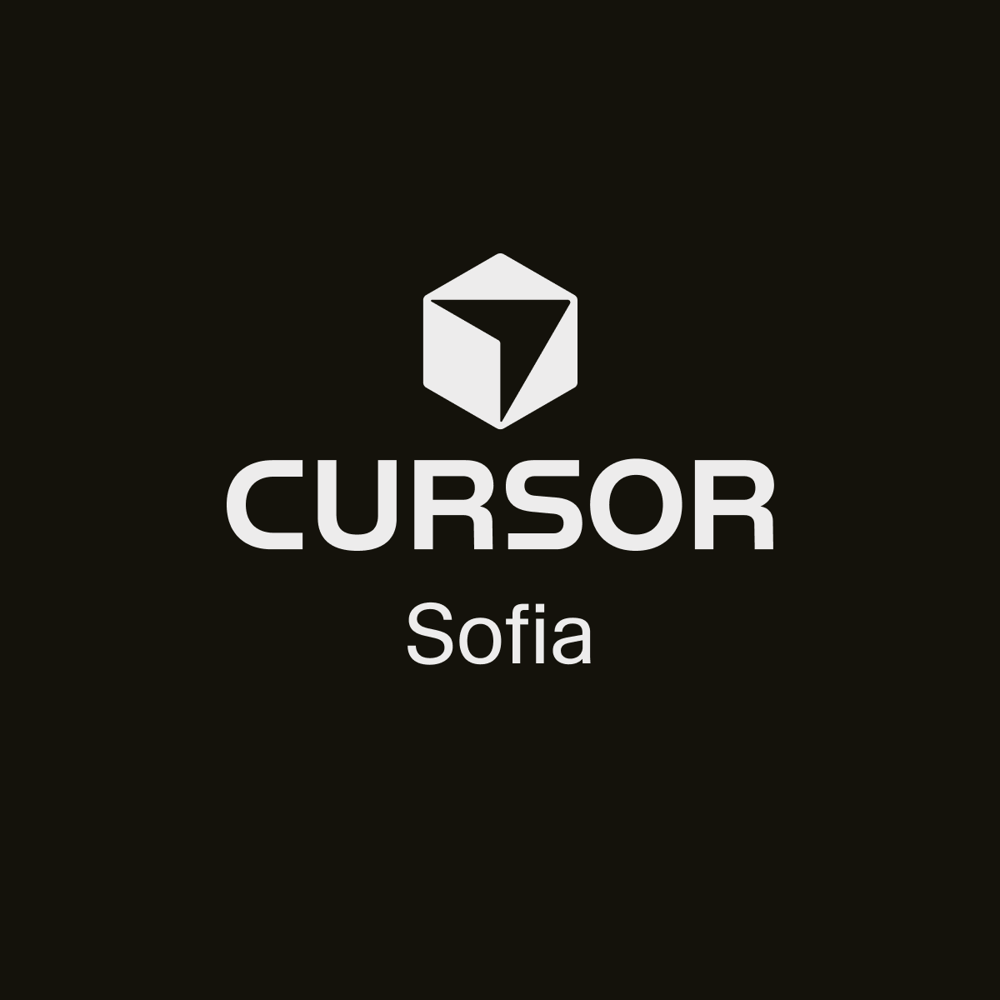

<h1 class="text-4xl md:text-6xl font-bold tracking-tight text-white">The Ralph Loop</h1>

Autonomous AI Coding with Clueless Persistence

Alexander Gekov

|

Co-Founder @ TalentSight

|

Cursor Ambassador 🇧🇬

20 January 2026 · Sofia

---

# 🤔 Quick Poll

  <h2 class="text-5xl font-bold">Who here knows what a Ralph Loop is?</h2>
  
👋 Raise your hand!

---

# For Those Who Don't Live on Twitter...

  
OK, for those who don't sit 24/7 on Twitter...

  
I see you 👀

  
*(points at crowd)*

---

# Meet Ralph Wiggum

  

    
  

  

    <h3 class="text-3xl font-bold mb-4">The Legend</h3>
    <ul class="text-xl space-y-3">
      <li>The least mentally capable character in The Simpsons</li>
      <li>Son of Police Chief Wiggum</li>
      <li>Famous for "I'm in danger" meme</li>
      <li>Now making headlines in AI coding... 🤖</li>
    </ul>
  

---

# The Ralph Wiggum Loop Technique

  

    

      <h3 class="text-xl font-bold mb-2 text-cyan-400">What is it?</h3>
      
An autonomous AI coding loop that iterates until completion

    

    

      <h3 class="text-xl font-bold mb-2 text-cyan-400">Who coined it?</h3>
      
<strong>Geoffrey Huntley</strong> (July 2025)

      
$RALPH meme token on Solana — he gets licensing revenue via Bags.fm 💰

    

    

      <h3 class="text-xl font-bold mb-2 text-cyan-400">The Name Origin</h3>
      
Named after Ralph's clueless persistence...

      
"I'm helping!"

    

  

  

    
  

---

# The Logic Behind Ralph Loop

  

    <pre class="bg-[#1a1a2e] p-4 rounded-xl text-sm font-mono overflow-x-auto"><code class="text-green-300">while :; do
  cat PROMPT.md | claude-code  # or cursor agent
  # Agent reads files, git history, specs each run
  # Fresh context every iteration!
done</code></pre>
    
"When vibe coders discover the while loop" 🔄

    
Stop condition: Agent produces <code class="bg-white/10 px-1 rounded">DONE</code> signal or all tests pass

  

  

    
  

---

# But It's Actually Smart! 🧠

  

    <h3 class="text-2xl font-bold mb-4 text-green-400">✅ Avoids Context Rot</h3>
    
Fresh context each iteration — no stale/accumulated noise!

  

  

    <h3 class="text-2xl font-bold mb-4 text-green-400">✅ Progress via Git/Files</h3>
    
Reads git history & files each run to know current state

  

  

    <h3 class="text-2xl font-bold mb-4 text-green-400">✅ Self-Correction</h3>
    
Automatically detects and fixes its own mistakes

  

  

    <h3 class="text-2xl font-bold mb-4 text-green-400">✅ Clear Stop Condition</h3>
    
Loops until explicit DONE signal or all tests pass

  

---

# From Claude Code to Cursor

<v-clicks>

- 📈 Ralph first grew in popularity with **Claude Code** extension
- 🎯 Now available in **Cursor** as well!

- 🔧 Let's see how to set it up...

</v-clicks>

  <h3 class="text-xl font-bold mb-4 text-cyan-400">Ralph Loop for Cursor</h3>
  
github.com/agrimsingh/ralph-wiggum-cursor

  
Cursor CLI implementation with deliberate context management

---

# Prerequisites for Ralph Loop

<h3 class="text-lg font-bold mb-2 text-cyan-400">🛠️ Tools Required</h3>
<ul class="text-sm space-y-1">
<li><strong>Cursor Agent CLI</strong> installed</li>
<li><strong>Git</strong> installed</li>
<li><strong>gum</strong> (optional, for pretty UI)</li>
</ul>

<h3 class="text-lg font-bold mb-2 text-purple-400">📦 Install Ralph</h3>
<pre class="text-xs bg-black/30 p-2 rounded mt-1 overflow-x-auto"><code>cd your-project
curl -fsSL https://raw.githubusercontent.com/
agrimsingh/ralph-wiggum-cursor/main/install.sh | bash</code></pre>

<h3 class="text-lg font-bold mb-2 text-red-400">📋 Detailed Specsheet</h3>
<ul class="text-sm space-y-1">
<li>Clear <strong>acceptance criteria</strong></li>
<li>Use <code class="bg-white/10 px-1 rounded">[ ]</code> checkboxes</li>
<li>Must be machine verifiable</li>
</ul>

<h3 class="text-lg font-bold mb-2 text-orange-400">🍽️ Token Budget</h3>

Ralph is HUNGRY for tokens! 🦛

✅ Limit iterations with <code class="bg-white/10 px-1 rounded">-n</code> flag

---

# Quick Start: Running Ralph

1️⃣ Define Task

Create <code class="bg-white/10 px-1 rounded">RALPH_TASK.md</code>:

<pre class="text-xs bg-black/40 p-2 rounded overflow-x-auto"><code>## Success Criteria
1. [ ] GET /health returns 200
2. [ ] POST /users creates user
3. [ ] All tests pass</code></pre>

2️⃣ Start Loop

<pre class="text-xs bg-black/40 p-2 rounded overflow-x-auto"><code>./.cursor/ralph-scripts/ralph-setup.sh</code></pre>

Interactive UI for model selection

Or CLI mode:

<pre class="text-xs bg-black/40 p-2 rounded mt-1"><code>./ralph-loop.sh -n 20</code></pre>

3️⃣ Monitor

<pre class="text-xs bg-black/40 p-2 rounded overflow-x-auto"><code>tail -f .ralph/activity.log</code></pre>

🟢 Healthy < 60%

🟡 Warning 60-80%

🔴 Rotation > 80%

---

# What Works Best with Ralph?

  <h3 class="text-2xl font-bold mb-4 text-green-400">✅ Great For</h3>
  <ul class="text-lg space-y-3 text-left">
    <li>🔧 **Refactoring** codebases</li>
    <li>🧪 **Writing tests**</li>
    <li>🔄 **Migrating** frameworks</li>
    <li>📝 **Implementing** specs</li>
    <li>🐛 **Fixing** bug batches</li>
  </ul>

  <h3 class="text-2xl font-bold mb-4 text-red-400">❌ Not Great For</h3>
  <ul class="text-lg space-y-3 text-left">
    <li>🎨 "Make it prettier"</li>
    <li>✨ "Make it better"</li>
    <li>🤷 Vague requirements</li>
    <li>🎭 Subjective improvements</li>
    <li>❓ Open-ended exploration</li>
  </ul>

Ralph iterates until it completes the specsheet — vague = infinite loop! 🔄

---

# Pro Tip: Iterate on Your Specsheet

  <h3 class="text-2xl font-bold mb-4 text-cyan-400">💡 Use LLM to Refine Your Spec</h3>
  
Before running Ralph, iterate with an LLM to make your specsheet as detailed as possible

  <h3 class="text-2xl font-bold mb-4 text-purple-400">📊 Order Matters</h3>
  
Tackle harder tasks first

  
This helps maintain clean context and prevents cascading failures

---

# Running the Loop

  <h2 class="text-4xl font-bold">Once ready, run the loop and... leave it be! 🚀</h2>
  
  

    

      
30 min

      
Quick tasks

    

    

      
1-2 hrs

      
Medium projects

    

    

      
4+ hrs

      
If you're feeling rich 💸

    

  

---

# Demo Time! 🎮

  <h2 class="text-3xl font-bold mb-4">Since we don't have 4 hours...</h2>
  
Let me show you a quick showcase of a Ralph Loop project!

  

    
📋 The Specsheet

  

  

    
🎯 Final Project

  

  

    
⏱️ ~1 Hour

  

  
For this project I also utilized:

  
🖼️ Replicate MCP

  
For generating sounds and images

---

# ⚠️ Important Caveat: YOLO Mode

<h3 class="text-3xl font-bold mb-6 text-orange-400">Ralph Loop is most effective in YOLO mode</h3>

= You don't need to confirm commands

<h4 class="text-xl font-bold text-red-400 mb-3">🚨 Security Risk!</h4>

Arbitrary code execution without human review

<h4 class="text-xl font-bold text-green-400 mb-3">✅ Solution: Sandboxes</h4>

Many sandbox offerings are popping up for safe code execution

---

# 📋 Specsheet Examples

<h3 class="text-xl font-bold text-yellow-400 mb-3">🟡 OK, but Vague</h3>
<a href="https://pastebin.com/mX1LDFXH" target="_blank" class="text-yellow-300 underline font-mono text-sm">pastebin.com/mX1LDFXH</a>
<ul class="text-sm mt-3 space-y-1 opacity-80">
<li>• High-level requirements only</li>
<li>• No specific test criteria</li>
<li>• Hard to verify completion</li>
<li>• May cause infinite loops!</li>
</ul>

<h3 class="text-xl font-bold text-green-400 mb-3">🟢 Detailed & Test-Driven ✅</h3>
<a href="https://pastebin.com/NCmB0dNC" target="_blank" class="text-green-300 underline font-mono text-sm">pastebin.com/NCmB0dNC</a>
<ul class="text-sm mt-3 space-y-1 opacity-80">
<li>• User stories with acceptance criteria</li>
<li>• Specific test commands</li>
<li>• Machine verifiable checkboxes</li>
<li>• Ralph knows when it's DONE</li>
</ul>

Let's see the detailed specsheet in action... 👇

---

# 🍉 Fruit Ninja Clone

  <h2 class="text-4xl font-bold">The Demo Project</h2>
  
A Fruit Ninja clone built entirely with Ralph Loop

  
  

    

      
⏱️ Time

      
~40 minutes

    

    

      
💰 Cost

      
~$8.98

    

  

  <a href="https://fruit-ninja-liard.vercel.app/" target="_blank" class="mt-6 px-6 py-3 bg-purple-500/20 border border-purple-500/50 rounded-xl text-purple-300 font-mono text-lg hover:bg-purple-500/30 transition">🔗 fruit-ninja-liard.vercel.app</a>
  
  
🎮 Let's see it in action!

---

# Reflection: The Debate 🤔

Vibe Coding vs Traditional Coding

<h3 class="text-xl font-bold text-green-400 mb-3">✅ What I Love About Ralph</h3>
<ul class="text-base space-y-2">
<li>Projects I never had time for can now be made easily</li>
<li>Spend $5-10 to test if a project has a future</li>
<li>Delete if you don't like it — low commitment!</li>
</ul>

<h3 class="text-xl font-bold text-red-400 mb-3">⚠️ The Reality Check</h3>
<ul class="text-base space-y-2">
<li>For serious software building...</li>
<li>Sorry, but Ralph is not AGI</li>
<li>We still need humans who think critically</li>
</ul>

---

# The Balance ⚖️

  

    A balanced use of AI is key —  
    and Ralph is anything but balanced
  

  

    

      
🎨 Quick Prototypes

      
Ralph shines here!

    

    

      
🏗️ Production Code

      
Human oversight essential

    

  

  

---
layout: center
class: text-center
---

# Thank You! 🙏

Cursor Community Sofia

Questions? Let's chat!

---
layout: center
class: text-center
---

# Connect With Me 🔗

Alexander Gekov

Scan to find me on socials

<small class="mt-8 opacity-50">© Cursor Community Sofia 2026</small>
